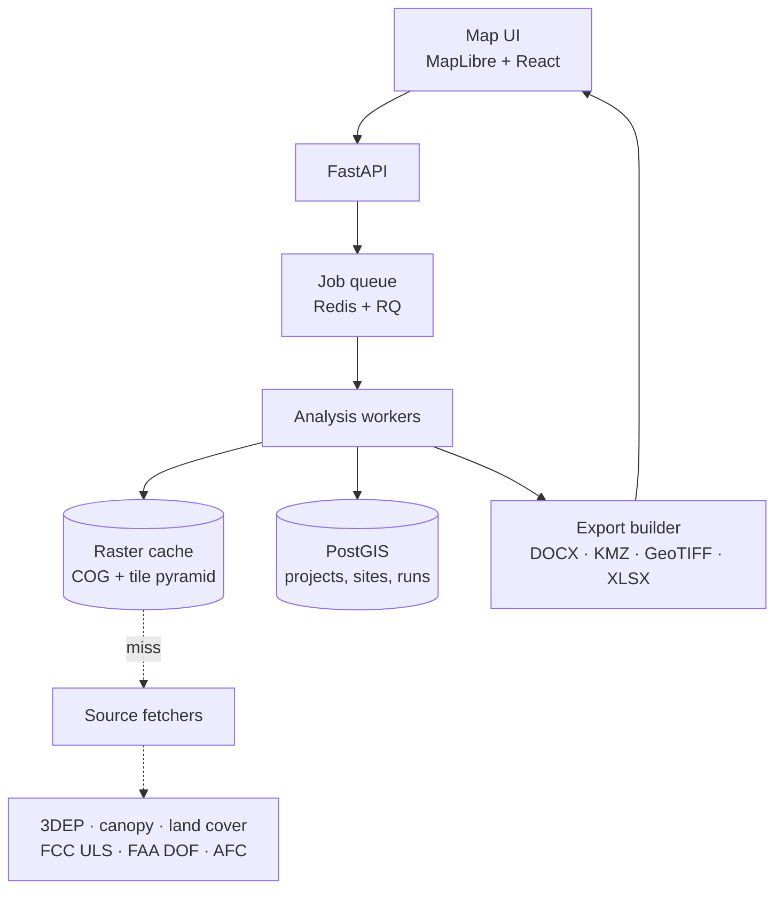

# National RF & Microwave Link Analysis Tool: Build Plan

*As of 17 September 2026 · Shane Turner*

## What the tool is

A browser-based planner that takes any point, path, or polygon in the United States and returns what the Waterfall Valley annex returned for one parcel in Colbert County: terrain and canopy line of sight, ranked candidate sites, backbone link budgets, signal-strength coverage, regulatory screening, and a finished report package. The annex took manual georeferencing, hand-assigned canopy heights, and custom scripts. The tool does it from a map click in minutes.

Five run types cover the work:

| Run type | Input | Core question answered | Primary output |
| --- | --- | --- | --- |
| Point-to-point link | Two endpoints, heights, band, radio spec | Will this link close, at what availability? | Path profile, Fresnel clearance, link budget, fade margin |
| Point-to-area coverage | One site, height, band, ERP | Where can this site be heard? | Received-signal raster, LOS raster, coverage percentage by land class |
| Multi-site network | AOI polygon plus candidate sites | Which combination of sites covers the most ground? | Site ranking, combined coverage, shadow inventory, backbone topology |
| Site discovery | AOI polygon only | Where should towers go? | Auto-generated candidate list from terrain maxima, screened and ranked |
| Wi-Fi / campus | Building footprint or site plan | How many APs, on what channels, at what throughput? | AP placement, channel plan, throughput map, AFC constraints |

Every run carries a regulatory overlay: what the site triggers under FAA Part 77, which FCC licensed paths sit nearby, what the band requires, and which state and local processes apply at that coordinate.

The unit of work is a **project**: an area of interest, a set of sites, a set of links, a set of runs, and the exported package. Projects persist, re-run against updated data, and diff against each other.

## What the Waterfall Valley annex already proves

The annex is the functional spec. It ran 98,736 DEM cells, nine candidate sites, exhaustive pairing and tripling, viewsheds at two tower heights against four receiver definitions, Fresnel clearance on seven backbone links across three bands, and produced a KMZ, two GeoTIFFs, two CSVs, a workbook, and a 14-section report. That pipeline works. The question is which parts of it were specific to that parcel.

| Annex step | How it was done there | What generalizing requires |
| --- | --- | --- |
| Establish the AOI | Georeferenced seven broker map images against BLM PLSS section lines by pixel fitting | Map-drawn polygon, uploaded KML/shapefile, parcel lookup by APN, or address geocode. Keep the image-georeferencing path as an optional import for exactly this case |
| Elevation | 3DEP ImageServer, 30 m grid plus 1 m point samples, one hard-coded frame | Tiled fetch with a local cache, automatic resolution selection, any extent, Alaska and territory fallbacks |
| Projection | UTM 16N, hard-coded | Auto-select the UTM zone or a local azimuthal equidistant projection from AOI centroid; handle zone-straddling AOIs |
| Canopy height | Assigned by stand type from a broker map: 80 ft hardwood, 65 ft pine, 3 ft open | Sample a national canopy height raster directly. This is the single largest accuracy upgrade available |
| Ground cover | Read off a forestry stand delineation figure | NLCD / LANDFIRE land cover, plus building footprints for built-up terrain |
| Viewshed | Custom 4/3-earth calculation on the 30 m grid | Same math, vectorized, with selectable k-factor and multi-observer accumulation |
| Site selection | Local maxima screened by hand, then exhaustive combinations of nine | Automated candidate generation plus a set-cover optimizer that scales past nine |
| Link analysis | Geometric clearance and 60 % F1 at three frequencies | Add full link budget, diffraction loss, rain fade, and availability |
| Regulatory | Two paragraphs of narrative on Part 90, NTIA, and land status | Live database screening against FCC ULS, FAA DOF, AFC, and per-state rules |
| Report | Written by hand around the computed numbers | Templated generator: same section structure, numbers injected, narrative assembled from run results |

Two cautions the annex states about itself carry into the tool and must stay visible in its output. Coverage is geometric line of sight, not a propagation prediction. Boundaries traced from unsurveyed sources are good to roughly 50 ft, enough to pick a ridge, not to set a monument. The tool should print its own error budget the same way.

## Architecture

Four pieces: a map front end, a thin API, a job queue with analysis workers, and a geospatial cache that grows as you use the tool. The cache is the design decision that matters most. National raster coverage is roughly 10 TB at 1 m; fetching on demand and keeping what you fetch turns that into gigabytes for the areas you actually work.



Runs are asynchronous. A multi-site viewshed over a 20,000 acre AOI at 10 m takes minutes, not seconds, so the UI submits a job, streams progress, and renders results as tile layers when the worker finishes.

**Layer responsibilities**

| Layer | Holds | Does not hold |
| --- | --- | --- |
| Front end | Map state, drawn geometry, run configuration, result layer toggles | Any analysis math |
| API | Project CRUD, job submission, result retrieval, export download | Long-running compute |
| Workers | Terrain sampling, viewshed, propagation, optimization, report generation | User session state |
| Cache | Clipped COGs keyed by AOI hash and source, with a TTL per source type | Anything derived that a run can recompute |
| PostGIS | Projects, AOIs, sites, links, run parameters, run results as metadata plus pointers to rasters | Raster pixels |

**Why PostGIS rather than files.** Site geometry, AOI polygons, regulatory query results, and the FCC path database are all vector data you query spatially. "Which licensed microwave paths cross within 2 km of this link" is a PostGIS query against an indexed table, not a file scan.

**Worker isolation.** Propagation libraries are C/C++ with Python bindings and will occasionally segfault on degenerate input. Workers run as separate processes so one bad path profile fails a job rather than the service.

## National data layer

Every source below is free and covers the whole country, with the exception of parcels. This is what makes "any state" a data question rather than a licensing one.

| Layer | Source | Resolution | Coverage | Access | Notes |
| --- | --- | --- | --- | --- | --- |
| Bare-earth elevation | [USGS 3DEP ImageServer](https://elevation.nationalmap.gov/arcgis/rest/services/3DEPElevation/ImageServer) | 1 m where lidar flown, 1/3 arc-sec (10 m) nationwide, 1 arc-sec in AK | 50 states plus territories | REST `exportImage`, or [OpenTopography API](https://opentopography.org/news/api-access-usgs-3dep-rasters-now-available) for bulk | The annex's source. 1 m is not everywhere; the tool must report which product it used per AOI |
| Lidar point cloud | USGS 3DEP LPC via AWS | Native | Where flown | S3 / entwine | Only for first-return canopy extraction if the CHM below is inadequate locally |
| Canopy height | [NAIP-CHM](https://zenodo.org/records/17664995) (0.6 m CONUS, published 2026) | 0.6 m | CONUS | Zenodo bulk, [Earth Engine](https://gee-community-catalog.org/projects/naip_chm_conus/) | Replaces the annex's hand-assigned 65/80 ft stand values outright |
| Canopy height (fallback) | [Meta/WRI global CHM](https://registry.opendata.aws/dataforgood-fb-forests/) | 1 m | Global, incl. AK/HI/territories | AWS Open Data | Use outside CONUS |
| Canopy / fuel structure | [LANDFIRE](https://landfire.gov/fuel/ch) forest canopy height, cover, base height | 30 m | 50 states | Direct download | Coarser but authoritative and versioned; good cross-check |
| Land cover | Annual NLCD (MRLC), which replaced the epochal NLCD releases | 30 m | 50 states | WMS / download | Drives clutter category and the annex's stand-type coverage breakdown |
| Building footprints | [Overture Maps](https://registry.opendata.aws/overture/) buildings, with heights where available | Vector | National | AWS Open Data, GeoParquet | Urban clutter and rooftop site candidates |
| Roads | Overture transportation / TIGER | Vector | National | AWS / Census | Site access scoring, the annex's "distance to nearest road" column |
| PLSS sections | BLM CadNSDI | Vector | PLSS states | ArcGIS REST | Legal description of a site; not available in the original colonies and Texas |
| Parcels | [Regrid](https://regrid.com/api) | Vector | \~156 M parcels national | Paid API | The only paid layer. Optional; county GIS portals are the free fallback |
| Place names | USGS GNIS | Point | National | Download | Names summits and drainages in the report, as the annex did |
| Obstructions | [FAA Digital Obstacle File](https://www.faa.gov/air_traffic/flight_info/aeronav/obst_data/) | Point | National | 56-day cycle download, [ArcGIS open data](https://adds-faa.opendata.arcgis.com/datasets/e202ff4e4cf943bda02ff63c0c44c9b7_0/data) | Existing towers: both obstacles to avoid and colocation candidates |
| Licensed spectrum | [FCC ULS public access files](https://www.fcc.gov/wireless/data/public-access-files-database-downloads) | n/a | National | Weekly bulk, daily deltas | Load into PostGIS. Section 8 |

**Caching strategy.** On first run against an AOI, fetch a buffered clip of each raster layer, write it as a Cloud Optimized GeoTIFF keyed by `(source, bbox_hash, resolution)`, and serve every subsequent run from disk. Elevation and canopy get long TTLs, measured in months. FCC and FAA tables refresh weekly on a scheduled job. A 20,000 acre AOI at 1 m elevation plus canopy is roughly 1.5 GB; at 10 m it is 15 MB. Default to 10 m for AOI-wide viewsheds and 1 m for path profiles and site pads.

**Resolution policy.** Terrain shadows in country like Waterfall Valley are cast by 300 ft valley walls, which 10 m resolves fine. Fresnel clearance on a 3 mi link and pad-level siting need 1 m. The tool should make that choice automatically and state it in the report rather than asking the user.

**Vertical datum.** 3DEP is NAVD88; GPS and most radios report ellipsoidal height. Apply the NGS geoid model for the region (GEOID18 for CONUS and PR/VI, GEOID12B for Alaska, with the modernized NSRS replacing both) so tower heights, AGL values, and aircraft altitudes are consistent. The annex did not need this because everything was internally consistent; a tool that mixes user-entered GPS heights with DEM values does.

### USGS REST APIs, specifically

The National Map exposes several REST services, and they are not interchangeable. Picking the wrong one is the difference between a run that takes 20 seconds and one that takes an hour. The [3DEPElevation ImageServer](https://elevation.nationalmap.gov/arcgis/rest/services/3DEPElevation/ImageServer) is an ArcGIS Image Service publishing 23 operations over a single-band F32 raster at \~1 m cell size in EPSG:3857, currently dated 24 August 2026, spanning −60.3 m to 3,922.5 m.

| Endpoint | Operation | Use it for | Do not use it for |
| --- | --- | --- | --- |
| `3DEPElevation/ImageServer/exportImage` | Returns a raster for a bbox at a requested size and format | Bulk AOI grids. Request `format=tiff`, `pixelType=F32`, `f=image`, and an explicit `bboxSR`/`imageSR` | Single points; it is heavy |
| `3DEPElevation/ImageServer/identify` | Elevation at one geometry | Occasional single lookups, cursor readout | Loops. One HTTP round trip per point |
| `3DEPElevation/ImageServer/getSamples` | Elevations along a geometry or a set of points, with `sampleDistance` | **Path profiles.** One call returns the whole profile between two endpoints | Area grids |
| `3DEPElevation/ImageServer/computeHistograms` | Statistics over an extent | The elevation-statistics table (min, max, percentiles) the annex's Table 3 reported | Anything needing per-cell values |
| Raster functions on `exportImage` | Server-side hillshade, slope, aspect, contours at 2/5/10 ft | Basemap rendering and the contour figures, computed server-side for free | Analysis inputs. Always fetch raw F32 for math |
| [`epqs.nationalmap.gov`](https://epqs.nationalmap.gov/) | Elevation Point Query Service, single point | Quick sanity checks, validation sampling | Production use. It is rate-limited and has been unstable historically |
| [Bulk Point Query Service](https://apps.nationalmap.gov/bulkpqs/) | Upload a point file, get elevations back | Batch validation sets | Interactive requests |
| [`3DEPElevationIndex/MapServer`](https://index.nationalmap.gov/arcgis/rest/services/3DEPElevationIndex/MapServer) | Vector index of what lidar exists where, at what resolution and vintage | **Determining data quality before running.** Tells you whether the AOI has 1 m lidar or only 10 m DEM | Elevation values |
| TNM Access API | Product search and download URLs across all National Map datasets | Bulk downloads of DEM tiles, NHD, structures | Point queries |

**Design rules that follow from this.**

- Query `3DEPElevationIndex` first on every new AOI, cache the answer with the project, and print it in the report. The annex could state "1 m native resolution in this area" because someone checked. The tool should check automatically and warn when an AOI straddles a lidar boundary, because coverage numbers computed across a 1 m/10 m seam are not comparable.
- Use `getSamples` for profiles and `exportImage` for grids. Never loop `identify`.
- Respect the service. It is free and unmetered but not unlimited: throttle to a few concurrent requests, back off on 429 and 503, and cache aggressively. A tiled fetcher with a local COG cache issues one round of requests per AOI, ever.
- Request in the analysis projection, not Web Mercator. `exportImage` reprojects server-side via `imageSR`; ask for the local UTM zone so cell sizes are true meters and viewshed distances are not distorted by latitude.
- Have a fallback. When the ImageServer is down, which happens, fall back to [OpenTopography's 3DEP API](https://opentopography.org/news/api-access-usgs-3dep-rasters-now-available) or to pre-staged tiles in the cache. A planning tool that stops working because one government endpoint is in maintenance is not a planning tool.

## Terrain and geometry engine

This is the part the annex already validated. Build it first, because everything else consumes its output.

**Surface model.** Three stacked surfaces, selectable per run:

1. Bare earth (3DEP DEM), for the hard terrain limit
2. Bare earth plus canopy (DEM + CHM), the realistic ground-receiver case
3. Bare earth plus canopy plus buildings (DSM), for built-up AOIs

The annex ran the first two and reported them separately. Keep that, because the gap between them is the whole argument for a sub-GHz NLOS layer.

**Earth curvature.** Effective earth radius factor *k*, default 4/3, user-selectable. Add a climate-aware default: *k* varies regionally and seasonally, and the ITU-R P.530 ΔN maps give a defensible per-coordinate value. For a 3 mi link the bulge is 3 ft and irrelevant; for a 40 mi microwave shot it is 100 ft and decisive.

**Viewshed.** R3 or XDraw over the sampled grid with the curvature correction applied to each ray. Vectorize with numpy over radial ray bundles; fall back to GRASS `r.viewshed` or Whitebox for large AOIs. Accumulate multi-observer coverage as a bitmask per cell so a 12-site network costs one pass per site and a single combine, not one pass per combination.

**Coverage accounting.** Report percentage covered by land-cover class, not just overall, exactly as the annex broke out valley hardwood, planted pine, plantation, and harvested. This is what turned an 80.7 % number into a usable finding: the valley floor was at 61 % and that drove the relay recommendation.

**Shadow inventory.** Cluster the uncovered cells, rank clusters by acreage, and report each with a centroid, floor elevation, and the nearest site that could see it from a relay. The annex's Table 7 did this by hand for eight hollows. Automate it: connected-component labeling on the uncovered mask, then a small optimization per cluster for relay placement.

**Path profiles.** Great-circle sample at DEM native resolution between endpoints, with the curvature-adjusted straight-line path overlaid, first Fresnel ellipsoid drawn at the run frequency, and minimum clearance reported over both bare earth and canopy. Flag the controlling obstacle by distance and elevation so the user knows which ridge is the problem.

**Fresnel.** F1 radius at any point: `r = 17.32 * sqrt(d1*d2/(f*D))` in meters with d in km and f in GHz. The 60 % criterion is the planning threshold; report actual clearance as a percentage of F1 rather than pass/fail, because 45 % with a strong margin is sometimes acceptable and 100 % with no margin is not.

**Site optimization.** Candidate generation by terrain local maxima within the AOI, filtered on slope, land cover, road distance, and parcel boundary. Then maximum-coverage set selection. Exhaustive search works to about 15 candidates choosing 3; past that use a greedy algorithm with a lazy-evaluation speedup, which for this problem class lands within a few percent of optimal. Constrain by the user's budget: "best 3 sites", "fewest sites for 90 % coverage", or "best coverage under a fixed tower height".

**Receiver definitions.** The annex ran four, and all four should be presets: ground receiver at 2 m, receiver in open stands only, aircraft at a specified AGL, and vehicle-mounted at 3 m. UAS work makes the airborne case the one that matters most, and it is also the case where the terrain problem largely evaporates.

**Constructability, which a pure RF ranking ignores.** The annex ranked sites on coverage and then discussed access, timber lease, and road distance in prose, and those non-RF factors are what actually decided between S3 and S2. Score them: slope at the pad, distance and grade to the nearest road, distance to commercial power, land ownership, and tower class implied by height under TIA-222 wind and ice loading for that county. A site that wins on coverage and loses on a two-mile access road is not the site.

**Units.** Store everything in SI internally and convert only at the display and report boundary. The annex reported feet for elevations and a US defense audience expects that, while every model in Section 6 takes meters, kilometers, and gigahertz. Mixing them in the engine is how a tool produces a confidently wrong answer.

## Propagation and link budgets

The annex's next-step list says to run the results through Radio Mobile or SPLAT. This tool absorbs that step. Do not write propagation models from scratch: use the reference implementations, which are the same code the regulators use.

| Model | Use | Range | Implementation |
| --- | --- | --- | --- |
| ITU-R P.1812 | Point-to-area coverage below 6 GHz, the primary engine | 30 MHz to 6 GHz | [Py1812](https://github.com/eeveetza/Py1812), the ITU's own reference code |
| ITU-R P.2001 | Wide-range terrestrial, 0 to 100 % of time. Covers the gap above 6 GHz | 30 MHz to 50 GHz | ITU reference implementation |
| ITU-R P.452 | Interference and coordination between stations | 100 MHz to 50 GHz | ITU reference implementation |
| Longley-Rice ITM | Cross-check and legacy comparability; what SPLAT and Radio Mobile use | 20 MHz to 20 GHz | [NTIA/ITS ITM](https://its.ntia.gov/software/its-open-source-software), C++ with a thin binding |
| ITU-R P.530 | Microwave LOS link design: multipath fade, availability, diversity | 150 MHz to 100 GHz | Implement directly; the recommendation is explicit arithmetic |
| ITU-R P.837 / P.838 | Rain rate and specific rain attenuation | Any | [ITU-Rpy](https://github.com/inigodelportillo/ITU-Rpy) |
| ITU-R P.676 | Gaseous absorption, matters above 10 GHz | Any | ITU-Rpy |
| ITU-R P.2108 | Clutter loss at the terminal | 0.5 to 67 GHz | [NTIA P.2108 wrapper](https://its.ntia.gov/software/its-open-source-software) |
| ITU-R P.833 | Vegetation attenuation | Any | Implement directly; the annex already cites its order of magnitude |
| ITU-R P.1238 | Indoor path loss, for the Wi-Fi layer | 300 MHz to 450 GHz | Implement directly |
| [crc-covlib](https://github.com/ic-crc/crc-covlib) | Alternative: one C++ library bundling P.1812, P.1411, ITM, and terrain handling | Varies | Evaluate as a shortcut past wiring six libraries together |

**Link budget.** Standard chain, computed per link and printed as a table the way a path calculation sheet reads:

`Rx power = Tx power − Tx line loss + Tx antenna gain − path loss − clutter loss − rain attenuation − gaseous absorption + Rx antenna gain − Rx line loss`

Then fade margin against receiver sensitivity at the selected modulation, and availability from P.530 multipath statistics plus rain outage. Report availability as nines and as minutes per year, because "99.99 %" means nothing to a program manager and "53 minutes of outage a year" does.

**Band presets.** Ship a table of the bands that actually get used, with default parameters so a user picks "900 MHz Part 90" rather than typing in nine numbers: 450 MHz, 900 MHz ISM, 1.4 GHz, 2.4 GHz, 3.65 GHz CBRS, 4.9 GHz public safety, 5.8 GHz U-NII, 6 GHz licensed and unlicensed, 11 GHz, 18 GHz, 23 GHz, 60 GHz, 70/80 GHz E-band. Each preset carries typical EIRP limits, channel widths, sensitivity figures, and rain sensitivity.

**Radio and antenna library.** A YAML catalog of real hardware: Ubiquiti, Cambium, Aviat, Ceragon, Silvus, Persistent Systems, Doodle Labs, Trellisware. Each entry has Tx power, sensitivity by MCS, and an antenna pattern. Support importing `.ant`, `.pat`, and Planet-format antenna files so vendor patterns drop in. Without real patterns the coverage maps are decorative.

**Rain is the reason this is a national tool.** A 23 GHz link that runs at 99.999 % in Yuma runs at 99.9 % on the Gulf Coast for the same hardware and distance, because ITU rain region K carries an order of magnitude more rain rate than region B. Getting that right per coordinate is the substantive difference between this and a terrain viewer.

**Diffraction.** P.1812 handles it internally. For the microwave path sheet also report single and multiple knife-edge diffraction loss by the Deygout or Epstein-Peterson construction, since that is what a path engineer expects to see against an obstruction.

**Above 6 GHz the tool must not claim area coverage.** P.1812 stops at 6 GHz and ITM at 20 GHz, so 23, 60, and 70/80 GHz have no point-to-area model worth trusting. For those bands the tool does deterministic LOS geometry plus a P.530 link design and says so. P.2001 and P.452 fill the 6 to 50 GHz range for interference and long-path work. E-band above 50 GHz is link design only: free space, rain, and gas.

**Interference and noise floor, which the first draft of this plan omitted.** Path loss tells you the signal; it does not tell you whether the link works. Three additions:

1. Carrier-to-interference between your own sites. A three-site network on one channel interferes with itself, and the coverage map should show C/I, not just signal level.
2. Ambient noise floor by environment category, from ITU-R P.372. In unlicensed bands near any population this dominates. A 2.4 GHz link in a town fails at a signal level that would be comfortable in the Waterfall Valley backcountry.
3. External interferers from the ULS and ASR data already loaded for Section 8, run through P.452. The regulatory screen and the interference calculation use the same dataset.

**Height above average terrain (HAAT).** Compute it from the DEM on the standard radials and report it per site. It is required on FCC filings, it drives several rule thresholds, and it is nearly free once the terrain engine exists.

**Geodesy detail.** Use geodesic distance and azimuth on the WGS84 ellipsoid (geographiclib), not spherical great-circle math. On a 3 mi link the difference is negligible; on a 40 mi path it moves the far-end azimuth enough to matter when you are pointing a 1-degree beamwidth dish.

**Reflections and diversity.** P.530 multipath assumes a reflection analysis over water and flat ground. Add NHD water bodies to the data layer, find the reflection point on each path, and recommend space or frequency diversity when a specular reflection lands on open water. Long paths over lakes and rivers fail for this reason and the terrain profile alone will not show it.

## Wi-Fi and 802.11 layer

Wi-Fi is a different problem from microwave: short range, dense reuse, capacity-limited rather than distance-limited, and governed by channel planning more than by terrain. Treat it as a separate mode sharing the same terrain and clutter foundation.

**Outdoor Wi-Fi** (site coverage, range Wi-Fi, mesh backhaul) uses the same P.1812 or ITM path loss the microwave side uses, with clutter loss from P.2108 and vegetation from P.833. This is the case that matters for a range or a training site, and it falls out of work already done.

**Indoor and near-building Wi-Fi** needs ITU-R P.1238 for indoor path loss and a wall-attenuation model driven by a floor plan the user uploads. This is a bigger build than it looks and should be Phase 4, not Phase 2.

**What the layer computes**

- Coverage by RSSI threshold, then by usable MCS, then by achievable PHY rate
- Throughput estimate from MCS, channel width, spatial streams, and a contention/airtime derate; a 6 GHz 160 MHz MCS 11 client at the cell edge is not getting its PHY rate
- Co-channel and adjacent-channel interference between planned APs
- Channel plan across 2.4, 5, and 6 GHz with DFS channels flagged by radar zone
- AP count and placement for a target throughput per area, not just a target signal level

**6 GHz is the reason to build this now.** The rules changed in January 2026. The FCC created a [Geofenced Variable Power class](https://docs.fcc.gov/public/attachments/DOC-417577A1.pdf) at up to 11 dBm/MHz PSD and 24 dBm EIRP in U-NII-5 and U-NII-7, alongside the existing VLP and AFC-controlled standard power. Three power regimes now coexist in one band, each with different range and different siting constraints, and picking between them is a real engineering decision the tool should make for the user.

| 6 GHz regime | EIRP | Constraint | Tool behavior |
| --- | --- | --- | --- |
| Standard power | Up to 36 dBm | AFC query required, exclusion zones around licensed microwave | Query an [approved AFC provider](https://6ghz.wirelessinnovation.org/fcc-approved-providers), return available channels and power at that coordinate |
| Geofenced variable power | 24 dBm EIRP, 11 dBm/MHz PSD, U-NII-5 and U-NII-7 | Location awareness, exclusion zones for microwave and radio astronomy | Model the exclusion geometry; flag when the site sits inside one |
| Low power indoor / VLP | 14 dBm EIRP VLP | Indoor only, or VLP anywhere | Default for indoor planning, no coordination |

**AFC integration.** The AFC query is a defined JSON interface. Implement it against one approved provider with a pluggable client so a second can be added. The result directly bounds the link budget: no point modeling 36 dBm EIRP at a coordinate where AFC allows 21.

## Regulatory and spectrum screening

A link that closes but cannot be licensed is not a link. Federal rules are uniform nationally, which is the good news; the state and local layer is where "any state" gets expensive.

### Federal, uniform across all 50 states

| Check | Source | What the tool returns |
| --- | --- | --- |
| Existing licensed paths | [FCC ULS](https://www.fcc.gov/wireless/data/public-access-files-database-downloads) weekly bulk, loaded to PostGIS | Every Part 101 path crossing within a buffer of the proposed link, with frequency, bandwidth, licensee, and azimuth. This is prior coordination screening, not a substitute for a coordinator |
| Band eligibility | Part 15, 90, 97, 101 rule tables encoded | Whether the user's service type may operate at the chosen frequency and power |
| FAA obstruction | Part 77 surfaces computed from the site, plus [DOF](https://www.faa.gov/air_traffic/flight_info/aeronav/obst_data/) | Whether the structure triggers Form 7460-1 notice, which surface it penetrates, the nearest airport and runway, and likely marking/lighting requirements |
| Existing structures | FAA DOF and FCC ASR | Colocation candidates within the AOI, often cheaper than building |
| 6 GHz standard power | AFC provider query | Available channels and permitted power at the coordinate |
| CBRS 3.5 GHz | SAS provider API | PAL/GAA availability, incumbent exclusion zones, coastal DPA proximity |
| Federal coordination | NTIA band plan encoded | Flag when the band requires NTIA/IRAC review rather than FCC licensing, as the annex noted for federal tenant use |
| Radio quiet zones | NRQZ, Table Mountain, and radio astronomy coordination zones as polygons | Hard stop or coordination flag. The NRQZ alone covers 13,000 sq mi across Virginia and West Virginia |
| Environmental and historic | NEPA categorical exclusions, [Section 106](https://www.fcc.gov/wireless/bureau-divisions/competition-infrastructure-policy-division/tower-construction-notification) tribal notification, FWS critical habitat, migratory bird | Screening flags with the applicable process named |

Two federal items belong in that table and were missing from the first draft:

**RF exposure evaluation.** Under 47 CFR 1.1307(b) and 1.1310 an antenna structure needs an RF exposure evaluation against the general-population and occupational MPE limits. Compute the compliance distance from EIRP, frequency, and antenna pattern, and return the boundary as a polygon around the site alongside whether the installation qualifies for an exemption. This is a required analysis, it is arithmetic the tool already has the inputs for, and leaving it out would be a real gap in anything handed to a customer.

**Height above average terrain and structure registration.** HAAT feeds FCC filings directly, and any structure over 200 ft AGL, or near an airport, needs FAA study and FCC Antenna Structure Registration. The tool should state which threshold a proposed height crosses rather than leaving the user to check.

### State and local, the variable part

This is where a national tool earns its keep, and where scope has to be bounded honestly. Do not attempt to encode every municipal zoning ordinance in the country. Encode the structured layer and point at the rest.

1. **State-level rules that are genuinely structured.** Roughly 35 states have small-cell or wireless-siting statutes with shot clocks, fee caps, and permitted-use provisions. These are tractable as a per-state record: statute citation, shot clock in days, whether state preemption applies, and which agency.
2. **Jurisdiction identification.** From the coordinate, name the state, county, municipality, and any special district, then link to that jurisdiction's zoning portal. Census TIGER plus Overture handles the boundary lookup nationally.
3. **Land ownership.** BLM SMA, USFS, NPS, DoD installation boundaries, state trust lands, tribal lands. A site on federal land changes the entire permitting path, and those boundaries are published nationally.
4. **Everything else is a checklist.** The report generates a per-site permitting checklist with the applicable federal items resolved and the local items named but unresolved, with contacts. The annex did exactly this for land status, timber lease, and hunting lease. That is the right level.

### What this section must not claim

The tool screens. It does not coordinate, and it does not give legal advice on siting. The output should say so on the regulatory page in one line: prior coordination with a certified frequency coordinator and an FAA determination are still required, and the screening is current as of the data refresh date printed on the page.

## Web application

One map, one left rail, one results drawer. Every run starts from geometry drawn on the map and ends with layers rendered back onto it.


**Screens**

| Screen | Contents |
| --- | --- |
| Projects | List, create, duplicate, archive. A project opens to its last map state |
| Map workspace | Basemap switcher (imagery, topo, terrain-shaded), draw tools for AOI/site/link, layer panel, elevation readout following the cursor |
| Site inspector | Per site: elevation, land cover, canopy height, slope, distance to road, distance to parcel edge, single-site coverage, regulatory flags |
| Path profile | The classic terrain profile view: terrain, canopy, curved ray, Fresnel ellipsoid, controlling obstacle marked, link budget table beside it |
| Coverage | Raster overlay with opacity and threshold controls, coverage percentages by land class, shadow cluster list |
| Regulatory | Per-site checklist with the federal items resolved and the local items named |
| Export | Choose formats, name the package, download |

**Interaction details that decide whether this is usable**

- Drag a site marker and the coverage layer recomputes on release. This needs a fast path: recompute at coarse resolution for the preview, full resolution on commit.
- Cursor readout shows ground elevation, canopy height, and height above the nearest link path at all times. Cheap to build, constantly useful.
- Every number on screen is clickable back to its inputs. If coverage says 80.7 %, clicking it shows the receiver height, surface model, and k-factor that produced it.
- Import and export KML/KMZ at every stage, because Google Earth is where this work gets reviewed with other people.

**Front end.** React with MapLibre GL JS. Raster results served as tiles from the worker output; vector results as GeoJSON. Terrain profile and link budget charts in a plotting library, not hand-rolled SVG.

**Auth.** Single user to start. Add per-project sharing later only if the tool leaves your machine.

## Deliverables and export

The export package is the product. A coverage map on a screen is worth little; the annex's eight-file package is what got handed to someone. Reproduce that set from any run.

| File | Contents | Library |
| --- | --- | --- |
| Report (DOCX and PDF) | The annex's structure, populated from run results | `python-docx` plus LibreOffice headless for PDF |
| KMZ | AOI, sites, links with clearance data, coverage ground overlay, named elevation points | `simplekml` |
| GeoTIFF | Elevation in meters and feet, coverage raster, signal-strength raster | `rasterio` |
| Key-point CSV | Every named point with lat/lon, UTM, elevation in both units | `pandas` |
| Grid CSV | The full sampled grid with land class and inside-AOI flags | `pandas` |
| XLSX workbook | Site table, link table, coverage table, budget sheets, grid data | `openpyxl` |
| Figures (PNG) | Terrain map with contours, coverage maps, path profiles, at 200 dpi | `matplotlib` plus `contextily` |
| Project JSON | Full run configuration for reproducibility | stdlib |

**Report generation is the hard half.** The annex reads as analysis, not as a form printout, because a person wrote the connective prose around the numbers. Three approaches, in order of effort:

1. **Template with computed slots.** Jinja-templated DOCX where every number, table, and figure comes from the run. Sentences are fixed with conditional branches: "No single site sees more than {max\_single}% of the parcel at {height} ft" with alternate phrasing when the figure is high. Gets 80 % of the way and is deterministic.
2. **Template plus generated narrative.** Same skeleton, but the findings summary, the shadow discussion, and the recommendation paragraphs are drafted by a model from the run's structured results. This is what makes each report read like the annex rather than like a form.
3. **Drafted from scratch each time.** Not worth it. The section structure should be stable so reports compare across projects.

Build approach 1 in Phase 3 and add approach 2 once the numbers are trustworthy.

**Section structure to carry over,** since it survived contact with a real audience: summary of findings that matter for siting, method and accuracy, AOI dimensions, elevation statistics, terrain character for radio planning, candidate sites table, recommended network and coverage, shadow inventory, backbone links and Fresnel clearance, NLOS layer, spectrum and licensing, site access and land status, limitations and next steps, delivered files.

**Provenance block.** Every export carries the source versions used: 3DEP product and vintage, CHM version, NLCD year, ULS refresh date, FAA DOF cycle. The annex named its sources and its data currency date. A tool that re-runs monthly needs this or its outputs cannot be compared.

## Validation and accuracy

The first validation case already exists. Run the tool against the Waterfall Valley AOI and check that it reproduces the annex: 4,392 acres inside the boundary, 485 ft low point, 960 ft high point, 80.7 % coverage from S1+S3+S4 at 150 ft, 155 ft minimum clearance on S3 to S4. If the numbers match, the terrain engine is right. If the canopy-derived numbers differ, that is expected and informative, because the CHM should beat the hand-assigned stand heights.

| Test class | Method | Pass criterion |
| --- | --- | --- |
| Terrain sampling | Compare against USGS Elevation Point Query Service at 200 random points | Within the stated 3DEP vertical accuracy |
| Geometry | Known-area polygons (PLSS sections are 640 acres nominal) | Within 0.5 % |
| Viewshed | Cross-check against GRASS `r.viewshed` on the same DEM and parameters | Cell agreement above 99 % |
| Propagation | Run the ITU's own P.1812 validation dataset through Py1812 | Match reference output to published tolerance |
| ITM | Compare against SPLAT! on identical profiles | Within 1 dB |
| Link budget | Hand-calculate three paths against a published path sheet | Exact |
| Rain | Compare P.837 rain rate output against published maps for five ITU regions | Match the recommendation's tables |
| Regulatory | Spot-check ULS results against the FCC's own web search for 10 known paths | Identical license set |

**Ground truth is the gap.** Every test above is a check against another model. The only real validation is a drive test or a field measurement, and that is what the annex's next-step list called for: a site walk with a pump-up mast. Two ways to close it:

1. Accept measurement imports. A CSV of GPS position and RSSI from a field survey, overlaid on the predicted coverage, with a residual statistic. This is the single most credible feature the tool could have.
2. Validate against known-good operational links. Any link you already know works, or does not, is a data point. Build a small internal library of them.

**Error budget to print in every report**

| Source | Typical magnitude |
| --- | --- |
| DEM vertical error | 10 cm to 1 m where lidar, several meters on 10 m data |
| Canopy height model | 2 to 4 m RMSE, worse in mixed stands |
| Propagation model | 6 to 14 dB standard deviation, which is the dominant term by far |
| Boundary geometry | Survey-grade if imported, \~15 m if traced |
| Clutter classification | Categorical, occasionally simply wrong |

The propagation term dominates everything else by an order of magnitude. Report coverage with a confidence level (P.1812 takes location and time percentages as inputs), not as a hard boundary, and say plainly in the output that a 6 to 14 dB model spread means the edge of a coverage polygon is an estimate, not a line on the ground.

## Build phases

Six phases. Each one ends with something that works end to end, so the tool is useful before it is finished. Effort estimates assume you working with Claude Code, not a team.

| Phase | Delivers | Working at the end | Effort |
| --- | --- | --- | --- |
| 0. Terrain core | 3DEP fetcher, COG cache, projection handling, path profile, viewshed, Fresnel | A Python library that reproduces the Waterfall Valley numbers from coordinates alone | 2 to 3 weeks |
| 1. Minimum web app | FastAPI, PostGIS, job queue, MapLibre UI, draw AOI, place sites, run viewshed, see coverage | Usable siting tool for any US location, LOS only | 3 to 4 weeks |
| 2. Propagation | Py1812, ITM, P.530, rain, link budgets, band presets, radio catalog | Real RF answers, not just geometry. This is where it stops being a terrain viewer | 3 to 4 weeks |
| 3. Export package | DOCX/PDF report generator, KMZ, GeoTIFF, XLSX, figures | The annex's eight-file package from a map click | 2 to 3 weeks |
| 4. Regulatory | ULS in PostGIS, FAA DOF and Part 77, AFC, CBRS, quiet zones, jurisdiction lookup, state statute table | Screening that answers "can I actually build this here" | 3 to 4 weeks |
| 5. Wi-Fi and refinement | 802.11 layer, AP placement, channel planning, site optimization, measurement import | The full scope | 3 to 4 weeks |

Roughly four months of concentrated work, longer in practice. Phase 0 and 1 together, call it six to eight weeks, already give you something better than what you built by hand for Waterfall Valley.

**Phase 0 in more detail,** because it is the one that determines whether the rest is easy:

1. AOI handling: polygon in, UTM zone selection, buffered bbox, area in acres
2. Elevation fetch with cache: `exportImage` tiled, written as COG, keyed and reused
3. Resolution selection from the 3DEP index, with the choice recorded
4. Canopy fetch from NAIP-CHM, aligned and resampled to the DEM grid
5. Surface stack: bare earth, plus canopy, plus buildings
6. Path profile with curvature and Fresnel, validated against the annex's seven links
7. Viewshed with multi-observer accumulation, validated against the annex's Table 5 and 6
8. Coverage accounting by land class and shadow clustering

Step 6 and 7 are the acceptance test. If the tool returns 80.7 % for S1+S3+S4 at 150 ft and 155 ft minimum clearance on S3 to S4, Phase 0 is done.

**Sequencing note.** Do not build the UI before the engine. The temptation with a map-driven tool is to start with the map because it is visible and satisfying. The engine is where the risk lives, and a library with a command-line driver is testable in a way a UI is not.

**Repository layout,** since this now lives at [AzJester/LinkAnalysisTool](https://github.com/AzJester/LinkAnalysisTool):

```
linkanalysis/
  core/        geodesy, projections, units
  data/        source fetchers and the cache
  terrain/     sampling, profiles, viewshed, HAAT
  propagation/ model wrappers, link budgets, interference
  wifi/        802.11 layer
  regulatory/  ULS, FAA, AFC, exposure, jurisdiction
  optimize/    candidate generation, set cover
  report/      templates and the export builders
api/           FastAPI app
web/           React front end
tests/fixtures/waterfall_valley/   the acceptance case
docs/          this plan and the reference notes
```

**Ship the Waterfall Valley data as a test fixture.** The annex's key-point CSV, the DEM grid, and its published results go in `tests/fixtures` as the regression case. Every change to the terrain or coverage engine runs against it, and any drift from 80.7 % coverage or 155 ft clearance fails the build. That turns a one-off analysis into a permanent contract on the engine's behavior.

**Library licensing.** NTIA/ITS code is US Government work and effectively public domain. The ITU reference implementations carry the ITU's own terms, which permit use but are not OSI licenses. Check each before choosing a license for this repo, and keep the propagation wrappers in a separate module so a licensing problem in one does not contaminate the rest.

## Stack, hosting, and cost

| Concern | Choice | Why |
| --- | --- | --- |
| Language | Python 3.12 | Every geospatial and propagation library lives here |
| API | FastAPI + Uvicorn | Async, typed, generates its own docs |
| Queue | Redis + RQ | Simpler than Celery for one user; swap later if needed |
| Database | PostgreSQL 16 + PostGIS 3.4 | Spatial queries over sites, links, and the ULS tables |
| Raster I/O | `rasterio`, `rioxarray`, GDAL 3.8+ | COG read/write, reprojection, windowed reads |
| Vector | `geopandas`, `shapely` 2.x | Shapely 2 is vectorized and much faster than 1.x |
| Numerics | `numpy`, `numba` for the viewshed inner loop | Viewshed is the hot path |
| Viewshed fallback | GRASS `r.viewshed` or `whitebox` | For AOIs too large for the in-process version |
| Propagation | Py1812, NTIA ITM, ITU-Rpy, NTIA P.2108 | Reference implementations, Section 6 |
| Front end | React + MapLibre GL JS + deck.gl | deck.gl for large point and raster overlays |
| Charts | Plotly or Observable Plot | Path profiles need interactivity |
| Documents | `python-docx`, `openpyxl`, `simplekml`, `matplotlib` | Same libraries the annex was built with |
| Container | Docker Compose | GDAL dependency hell is real; containerize from day one |

**Hosting.** Run it locally first. The workload is bursty and single-user, which is the worst possible fit for always-on cloud compute. A machine with 8 cores, 32 GB RAM, and a fast 1 TB SSD handles everything in this plan. Docker Compose on your own hardware costs nothing per month and keeps the terrain cache on local disk where it belongs.

If it eventually needs to be reachable from elsewhere, a single VPS at 4 vCPU and 16 GB runs roughly $50 to $80 a month, plus block storage for the cache. Object storage for the cache adds egress cost and latency; keep rasters on a local volume.

**Running costs**

| Item | Cost |
| --- | --- |
| All federal data (3DEP, NLCD, LANDFIRE, FCC, FAA, Census, BLM) | $0 |
| NAIP-CHM canopy, Meta CHM, Overture | $0 |
| AFC queries | Free tier available from approved providers; verify per provider |
| CBRS SAS access | Varies; some free developer tiers |
| Regrid parcels | Paid, and the only paid layer. Skip until you need it |
| Local hosting | $0 |
| Storage | The cache grows with use. Budget 1 TB; a heavily used year of AOIs is well under that |

**The one real cost is your time,** which the phase table already prices. Nothing in this plan requires a software purchase.

## Risks and open decisions

**The hard problems, ranked**

1. **Propagation model uncertainty swamps everything else.** A 6 to 14 dB standard deviation means coverage edges are soft. The risk is not that the model is wrong; it is that a clean map persuades someone the answer is precise. Mitigate by showing confidence bands, not hard boundaries, and by building measurement import early.
2. **Viewshed performance at scale.** A 50,000 acre AOI at 1 m is 200 million cells. Multi-observer viewsheds at that size will not run in a request cycle. Mitigate with resolution tiering, numba, and an honest progress bar.
3. **Data heterogeneity across states.** 1 m lidar covers most of CONUS but not all; Alaska is largely 5 m IfSAR; territories vary. NAIP-CHM is CONUS-only. PLSS does not exist in the original 13 states or Texas. The tool must degrade gracefully and say what it degraded to, rather than silently returning worse answers.
4. **The regulatory layer ages.** FCC rules moved in January 2026 on 6 GHz alone. Anything encoded as a rule table needs a review cadence and a visible "rules as of" date.
5. **Report quality.** The annex reads well because a person wrote it. A generated report that reads like a form printout will not get used, and this is a real risk to the whole effort's value.

**Decisions to make before Phase 1 starts**

- [ ] Local-only, or reachable from a browser away from your machine? This changes auth, hosting, and cost.
- [ ] Does anything ever touch controlled or CUI siting data? If yes, that constraint drives hosting from day one and cannot be retrofitted cheaply.
- [ ] Buy Regrid parcels, or live with county GIS portals and hand-drawn AOIs?
- [ ] Is the primary use case UAS and counter-UAS work, as at Waterfall Valley? If so, the airborne receiver case and low-altitude coverage deserve first-class treatment over the ground case.
- [ ] Build the Claude skill wrapper alongside the web app, so you can drive runs conversationally and have reports drafted from run output, or keep the tool standalone?

**What would make this fail.** Scope creep into a general-purpose GIS. The tool should do link analysis and siting very well and refuse to become a mapping platform. Every feature that is not answering "will this link work" or "where should this go" is a candidate for deletion.

**Sources.** [USGS 3DEP ImageServer](https://elevation.nationalmap.gov/arcgis/rest/services/3DEPElevation/ImageServer) · [3DEP Elevation Index](https://index.nationalmap.gov/arcgis/rest/services/3DEPElevationIndex/MapServer) · [OpenTopography 3DEP API](https://opentopography.org/news/api-access-usgs-3dep-rasters-now-available) · [NAIP-CHM canopy height model](https://zenodo.org/records/17664995) · [Meta/WRI canopy height](https://registry.opendata.aws/dataforgood-fb-forests/) · [LANDFIRE](https://landfire.gov/fuel/ch) · [Overture Maps](https://registry.opendata.aws/overture/) · [Regrid](https://regrid.com/api) · [FCC ULS bulk downloads](https://www.fcc.gov/wireless/data/public-access-files-database-downloads) · [FCC 6 GHz order, 8 Jan 2026](https://docs.fcc.gov/public/attachments/DOC-417577A1.pdf) · [FCC-approved AFC providers](https://6ghz.wirelessinnovation.org/fcc-approved-providers) · [FAA Digital Obstacle File](https://www.faa.gov/air_traffic/flight_info/aeronav/obst_data/) · [NTIA/ITS propagation software](https://its.ntia.gov/software/its-open-source-software) · [Py1812](https://github.com/eeveetza/Py1812) · [ITU-Rpy](https://github.com/inigodelportillo/ITU-Rpy) · [crc-covlib](https://github.com/ic-crc/crc-covlib). Waterfall Valley figures from your 17 September 2026 siting analysis annex.
