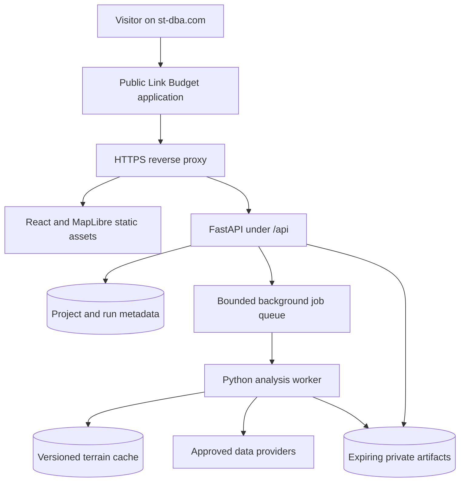

# LinkAnalysisTool: revised build plan for st-dba.com

Accepted revision, 17 September 2026. Based on review of repository commit `960ec456048d21dfaa7e130614e265019babe6ce`. The [review](PLAN_REVIEW.md) contains the evidence and source references behind these changes. The original plan is archived in [ORIGINAL_BUILD_PLAN.md](ORIGINAL_BUILD_PLAN.md).

**Release 1.0:** the bounded point-to-point workflow now includes live USGS terrain, free-space directional budgets, obstacle/Fresnel geometry, local project persistence and JSON/CSV/print exports. Advanced availability, area coverage, optimization, regulatory screening and specialized Wi-Fi remain future validation-gated stages. The accepted [architecture decision](ARCHITECTURE.md) supersedes the draft's mandatory database and separate-worker requirements for this bounded release. See [deployment operations](DEPLOYMENT.md).

## Product requirement

Build a public, independently hosted browser application on the st-dba.com domain. Its first complete workflow answers: **Can these two radios communicate over this path, with what calculated signal margin, and what terrain/Fresnel limitations?**

Users select two endpoints, enter antenna heights and radio parameters, inspect the terrain profile and both directional budgets, change assumptions, and download the calculation. Anonymous visitors can run a bounded basic analysis. Administrative access and durable private project storage are separate capabilities. Public access does not expose all visitors' projects or results.

The application requires no ChatGPT account, ChatGPT hosting, LLM-generated numerical results, or conversational wrapper. Numerical calculations and first-release reports are deterministic. An optional future narrative service must never become a dependency for calculations or exports.

## Public URL and deployment

Canonical URL: `https://linkbudget.st-dba.com/`, with a Link Budget Tool entry on the existing main site. Deployment and verification follow [DEPLOYMENT.md](DEPLOYMENT.md).

If the required canonical URL is `https://st-dba.com/tools/link-budget/`, publish the frontend under that path and configure the existing host or edge proxy to route the application and API correctly. Verify path-based assets, navigation, browser refresh and downloads. Do not change root-domain DNS to move the entire existing site simply to host this tool.

Before provisioning, inspect the current hosting account's support for custom subdomains, static assets, reverse proxies, containers or long-running Python, persistent volumes and TLS. Reuse suitable existing capacity. Otherwise select one independently controlled Linux compute host after obtaining a current price and benchmarking a representative path and area job.



Release 1.0 uses one Docker service on the existing Render account with same-origin API/assets and managed TLS. Docker Compose also supports self-hosting. The [architecture decision](ARCHITECTURE.md) specifies bounded asynchronous workers, expiring in-memory state and local project persistence. Before durable cloud projects or heavy area jobs, introduce private database/queue services, isolated processes, persistent caches, backups and tested restoration. Maintain health checks and rollback procedures for every release.

The full terrain and propagation product needs server compute. A static calculator could be offered as a separate limited mode, but it would not deliver the planned geospatial worker functions by itself.

## First release: the point-to-point tool

| Area | Required behavior |
| --- | --- |
| Endpoints | Click two map locations or enter coordinates. Show A and B clearly. Use geodesic distance and forward/reverse bearings. |
| Heights | Separate ground elevation, antenna AGL and antenna absolute elevation. Record horizontal and vertical references. |
| Radio inputs | Custom values first: frequency, transmit power, feeder loss, antenna gain, polarization, bandwidth, receiver sensitivity and its modulation/performance conditions, for each end. |
| Presets | Custom radios in 1.0. Add vendor presets after data sheets, dates, modulation, channel width and sensitivity conditions are reviewed. No invented generic sensitivity by band. |
| Terrain | Fetch a bounded corridor, identify the actual elevation product and resolution, show gaps and source age, permit explicit obstacle additions. |
| Profile | Display terrain, optional documented clutter, antenna ray, curvature assumption, full first Fresnel zone and selected clearance fraction. Identify the controlling obstruction. |
| Budget | Show every gain/loss, received power, receiver threshold and margin for A-to-B and B-to-A. Identify the limiting direction. |
| Result | Separate geometric clearance, nominal link margin, regulatory screening status and modeled availability. Missing inputs produce unavailable fields, not silent defaults. |
| Availability | Show only after the selected microwave method and its edition pass validation. An initial release can report margin while stating that availability is not modeled. |
| Export | Printable calculation, CSV budget and versioned project JSON, including inputs, sources, assumptions, model versions and application version. |
| Interaction | Recalculate on committed edits; keep requests bounded and cancel obsolete work. Support keyboard entry and readable mobile results. |

A positive free-space margin on an obstructed path must not be presented as an affirmative working-link prediction. Preserve the nominal calculation, explain the obstruction, and require an applicable validated model before returning a modeled obstructed-path result.

## Calculation contract

Store physical quantities with explicit units. Use a canonical unit system for storage, with named conversions at model boundaries and display. Distinguish logarithmic quantities: dB is a ratio, dBm is power relative to 1 mW, dBi is isotropic antenna gain. Distinguish ERP from EIRP.

For each direction:

```text
EIRP_dBm = conducted_tx_power_dBm - tx_feed_loss_dB + tx_gain_dBi
received_power_dBm = EIRP_dBm - modeled_path_loss_dB
                     - additional_nonoverlapping_losses_dB
                     + rx_gain_dBi - rx_feed_loss_dB
margin_dB = received_power_dBm - sensitivity_dBm
```

Every propagation adapter must report its recommendation edition, code version, validity limits, inputs, total loss and included effects. Use one coherent base model per result. Add only losses excluded from that model. Keep geometric canopy/roof envelopes separate from terrain and clutter inputs expected by a propagation implementation.

Where noise figure and equivalent noise bandwidth are supplied, a thermal-noise baseline at 290 K is `-174 + 10*log10(bandwidth_Hz) + noise_figure_dB` in dBm. Do not call that a measured local interference floor. Sum interfering powers in linear units before computing SINR. Do not count noise figure twice when using an already specified sensitivity threshold.

Receiver sensitivity must state the required BER/PER or vendor performance condition and channel width. Report directional asymmetry. A path may be reciprocal in loss while the radio budgets differ.

Calculate Fresnel clearance along the entire sampled path, not just at its midpoint. The familiar 60% fraction is a configurable design criterion. Specify sampling, interpolation, endpoint handling, curvature and invalid/nodata behavior. Use a WGS84 ellipsoidal geodesic to construct the path.

Use a model registry with explicit valid frequency, distance, antenna-height and statistical ranges. Do not extrapolate P.1812 above 6 GHz or use it unchecked for short Wi-Fi paths. Initial area propagation can be restricted to validated terrestrial cases at or below 6 GHz. Any future 6 GHz Wi-Fi mode must cover its actual channel frequencies with suitable methods.

Treat microwave availability as a separate result. Pin the P.530 edition, implement only validated applicable procedures, and state annual versus worst-month statistics. Combine rain and multipath as specified by the chosen method. Express both percentage and annual minutes only when an annual result is available, with equipment/power exclusions explicit.

## Data and reproducibility

Build source adapters around official terrain products and an explicit regional capability table. A request can be supported with full inputs, supported with named limitations, or unsupported. Missing canopy must be labeled unknown; it must not silently become open land.

Each source asset records product identifier, geographic footprint, native resolution, acquisition date where available, publication/retrieval date, horizontal and vertical reference, scale/units, nodata, license and checksum. A service publication date does not substitute for tile vintage.

Before mixing GPS elevations with a DEM, establish the actual vertical references. Some GPS outputs already apply a geoid correction. Apply transformations only when supported and record them. Do not assume NAVD88 for every region or assume every GNSS height is ellipsoidal.

For geometry/area analysis, select a suitable local projection or use documented geodesic area. Define raster alignment, cell inclusion or fractional weighting, nodata denominator and edge behavior. Cache source tiles by source version and grid parameters, and clip for runs. Preserve immutable run manifests even when a source cache refreshes.

Use native-resolution terrain for profiles when available, subject to published performance limits. Upsampling coarse data must never be labeled higher-quality source data. Use canopy predictions as predictions, with their acquisition/model dates and local limitations. Combine mutually overlapping above-ground obstacles using an explicit envelope policy.

Do a real download-and-sample proof for each proposed provider before adding it to the supported data matrix. Check public-service and redistribution terms for OpenTopography, canopy products, ITU digital maps, basemaps, geocoding, AFC and SAS. Keep all secret provider credentials on the server. A fallback dependent on the same failing upstream source is not an independent outage fallback.

## Public resource and privacy controls

Introduce limits before any anonymous compute endpoint is exposed. Make the limits configurable and publish them next to the Run action. Establish numeric launch limits using a repeatable benchmark of the actual host; until configured, an expensive analysis route should remain disabled.

Bound path length, sample count, area, grid cells, candidate sites, uploaded bytes, decompressed bytes, runtime, memory, retained storage, concurrent jobs per visitor and total active jobs. Enforce the same limits on the server. Show queue status, cancel jobs and expire abandoned results. Apply admission control before downloading terrain or allocating large grids.

Anonymous jobs use high-entropy identifiers plus a session-bound access check or scoped capability. One visitor must not list or fetch another visitor's runs. Durable saved projects require an ownership mechanism; the public calculator stays accessible without a required account. Protect administrator routes separately.

Start imports with versioned JSON and simple supported geometry formats. Validate finite coordinates, projection, geometry bounds and allowed file types. When adding KMZ/shapefile archives, handle traversal, external references and decompression limits. Escape report fields and spreadsheet text. Fetch raster data only from configured source adapters, not arbitrary visitor-supplied URLs.

Define job states, bounded retries, idempotency, progress, timeout, cancellation, failure recovery and retention. Separate short point-to-point work from later area jobs so a large viewshed cannot consume all public capacity. Record job duration, queue wait, cache size, provider failures and storage use.

## Validation gates

The historical Waterfall Valley numbers remain evidence until their inputs and denominators are reconciled. Keep a frozen reproducibility suite separate from live-source integration tests and field-performance evaluation.

| Gate | Required evidence |
| --- | --- |
| Fixture reconciliation | Explicit grid/mask and rules; explain 19,430 versus 19,004 cells and 834 versus 816.583 uncovered acres; account for missing shadow acreage, stand layer and S9. Preserve historical values and document corrections. |
| Deterministic arithmetic | Independently calculated link sheets, free-space loss, units, gains/losses, both link directions, ERP/EIRP, bandwidth, sensitivities and threshold cases. Specify numerical tolerances. |
| Geodesy and terrain | Known coordinate pairs, synthetic terrain, negative elevations, nodata, datum mismatches, grid edges and appropriate projection handling. |
| Fresnel and visibility | Flat terrain, one blocking ridge, endpoint handling and curvature; compare with an independent engine using matched conventions. Explain disagreement instead of enforcing an arbitrary agreement threshold. |
| Propagation | Selected implementation's reference vectors and validity boundaries, with a test that extra clutter/rain/gas is not charged twice. |
| Availability | Version-specific microwave/rain reference cases, annual/worst-month conversion, probability limits and unavailable cases. |
| Public isolation and limits | Two unrelated visitor sessions, inaccessible foreign results, rejected oversized requests, bounded queue behavior and successful cancellation. |
| Deployment | Public domain, HTTPS, refresh/deep links, API calls, source retrieval, downloads, mobile layout, worker restart, retained data and tested restore/rollback. |

The original 12 tests establish only fixture consistency. Release 1.0 adds actual calculation, service, provider and import tests described in [VALIDATION.md](VALIDATION.md). Unreconciled historical coverage values remain separate.

Import measurement CSVs early enough to compare predictions with observed RSSI. Record radio, bandwidth, transmit power, antenna configuration, position and time. Keep calibration samples separate from independent evaluation samples; report bias and spread for the actual sampled population.

## Implementation sequence

| Stage | Deliverable | Completion condition |
| --- | --- | --- |
| 0. Establish the engineering baseline | Reconciled fixture; versioned input/result schema; loss-accounting specification; provider/license proofs; hosting route decision; dependency manifest and CI | Known-answer numerical tests and the documented fixture baseline pass. Supported and unsupported conditions are explicit. |
| 1. Publish the point-to-point application | Map endpoints, terrain/Fresnel profile, both directional budgets, clear margin/obstruction results, custom radios, print/CSV/JSON, public limits and visitor isolation | An anonymous visitor completes a bounded real calculation and downloads a reproducible result on the owner's domain. |
| 2. Add validated microwave reliability | Rain/gas and applicable P.530 procedures, edition-specific validation, supported availability reporting, improved radio catalog and field measurement import | Verified reference cases pass; outputs distinguish modeled propagation outage from full system uptime. |
| 3. Add coverage and network planning | P.1812/ITM as appropriate, terrain/canopy comparison, land-class coverage, shadows, candidates and network optimization | Representative performance benchmarks pass; site selection respects viable backbone connectivity; exact and approximate optimization results are labeled. |
| 4. Add screened regulatory workflows | ULS, FAA airport/runway/obstacle inputs, versioned band rules, applicable exposure-screening method; AFC/SAS only after access is verified | Known examples reproduce; source age and unresolved requirements are explicit. No planning screen is presented as an authorization. |
| 5. Add specialized modes and exports | Indoor/outdoor Wi-Fi using appropriate models, channel/capacity analysis, approved 6 GHz device regimes, DOCX/KMZ/GeoTIFF/XLSX packages | Each new model and format has a focused acceptance case. Large raster grids remain raster files rather than oversized spreadsheets. |

The engine remains independently testable, but the first release should include a public end-to-end calculation. Do not wait for national regulatory databases, indoor AP optimization and every export format before making the core link budget useful.

Use Python/FastAPI and React/MapLibre, following [ARCHITECTURE.md](ARCHITECTURE.md) for release 1.0. Introduce separate worker processes and persistent caches before large terrain/propagation workloads. PostgreSQL/PostGIS is suitable for spatial projects and later regulatory data; Redis/RQ requires tested failure/retry behavior. Lock compatible packages and identify deployed images. Do not assume every dependency is native C/C++ or that every wrapper validates its inputs.

## Cost and launch decisions

An independently hosted public service has an operating budget even when its source data is free. Price the selected compute, storage, backups, transfer, basemap/geocoding and any paid API access after benchmarking. Use hard cache and job limits. Start with one suitably sized host and add capacity only when measurements justify it.

The reviewed repository does not establish enough evidence to endorse the original four-month estimate, a fixed server size, a one-terabyte lifetime cache, or zero monthly operating cost. Estimate each stage after Stage 0, distinguishing implementation effort from source access, scientific validation and production readiness.

The initial decision is the existing Render account's free web-service tier at linkbudget.st-dba.com, with idle spin-down and shared allowances acknowledged. Later paid or always-on capacity requires an operating-budget decision. Source limitations and advanced model availability must remain visible product behavior, not reasons to invent results.
